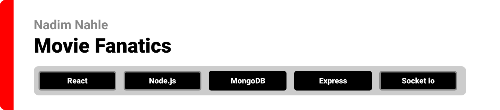
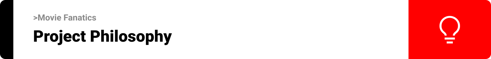
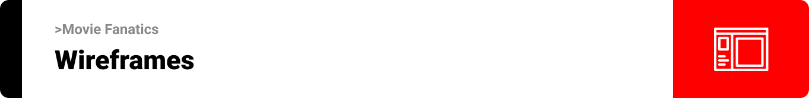
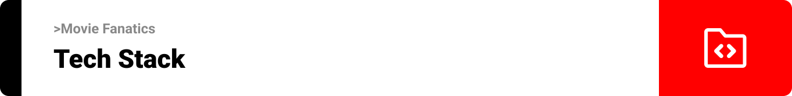
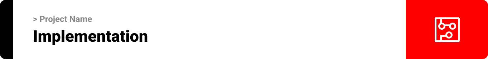

<div align="center">

> Hello world! This is the project’s summary that describes the project plain and simple, limited to the space available. 

  
**[PROJECT PHILOSOPHY](#project-philosophy) • [WIREFRAMES](#wireframes) • [TECH STACK](#tech-stack) • [IMPLEMENTATION](#implementation) • [HOW TO RUN?](#how-to-run)**

</div>

<br><br>



> Movie fanatics is a website for movie lovers, our philosophy is to connect users based on their movie taste in order to discuss these movies.<br/>

### Normal user Stories
- As a user, I can check trending movies or search for any movie and watch or download trailers.
- As a user, I can follow other users by swiping right based on their favorite movie.
- As a user, I can connect with my followings via live chat to discuss movies or tv shows.

### Premium user Stories
- As a premium user, I get access to a chatbot that provides exclusive links to download movies.

### Premium user Stories
- As an admin, I can acess the admin panel using a face recognition login system.
- As an admin, I can track users and delete or edit any user.

<br><br>



> This design was planned before on paper, then moved to Figma app for the fine details.
Note that i didn't use any styling library or theme, all from scratch and using pure css modules

| Landing  | Movies  |
| -----------------| -----|
|  |  |

|Sign up | Live chat  |
| -----------------| -----|
|  |  |


<br><br>



Here's a brief high-level overview of the tech stack the Well app uses:

- This project uses the [React Library](www.reactjs.org). React is a free and open-source front-end JavaScript library for building user interfaces based on UI components.

- The admin panel is created using the [React Library](https://reactjs.org/) inside the [Electron.js Framework](https://www.electronjs.org).

- The server side of the project is build using the [Node.js environment](https://nodejs.org/en/) and the [Express Framework](https://expressjs.com/).

- For database, the app uses the [MongoDB database](https://www.mongodb.com/). MongoDB is a source-available cross-platform document-oriented database program.

- For live chat, the app uses the [Socket io library](https://socket.io/). Socket io is a library that enables low-latency, bidirectional and event-based communication between a client and a server.


<br><br>



Using the above mentioned tech stacks and the wireframes build with figma from the user sotries we have, the implementation of the app is shown as below, these are screenshots from the real app

| Admin login using face recognition  | Google Login  |
| -----------------| -----|
|  | 

| Live chat | Swipe right or left!  |
| -----------------| -----|
|  | 

| Movies and chrome extension | Chatbot for premium users  |
| -----------------| -----|
|  | 

| Profile | Responsiveness  |
| -----------------| -----|
|  | 

<br><br>


> This is an example of how you may give instructions on setting up your project locally.
To get a local copy up and running follow these simple example steps.

### Prerequisites

This is an example of how to list things you need to use the software and how to install them.
* npm
  ```sh
  npm install npm@latest -g
  ```

### Installation

_Below is an example of how you can instruct your audience on installing and setting up your app. This template doesn't rely on any external dependencies or services._

1. Contact me for apis keys
2. Clone the repo
   ```sh
   git clone https://github.com/Nadim-Nahle/Movies-Fanatics.git
   ```
3. Open `backend-Node` folder

4. Install NPM packages
   ```sh
   npm install
   ```
5. Enter your API in `.env`
   ```js
   const API_KEY = 'ENTER YOUR API';
   ```
6. run `npm start` to run the backend
   ```sh
   npm start';
   ```
7. Open `backend-Node` folder

8. Install NPM packages
   ```sh
   npm install
   ```
9. run `npm run start` to run the socket
   ```sh
   npm run start';
   ```
10. Open `frontend-react` folder

11. Install NPM packages
   ```sh
   npm install
   ```
12. Enter your API in `.env`
   ```js
   const API_KEY = 'ENTER YOUR API';
   ```
13. run `npm start` to run the frontend
   ```sh
   npm start';
   ```
14. Open `electron-react-admin` folder

15. Install NPM packages
   ```sh
   npm install
   ```
16. run `npm run electron` to run the electron admin dashboard
   ```sh
   npm run electron';
   ```
17. Enjoy the project!
   

